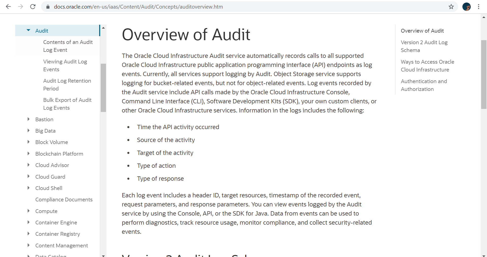
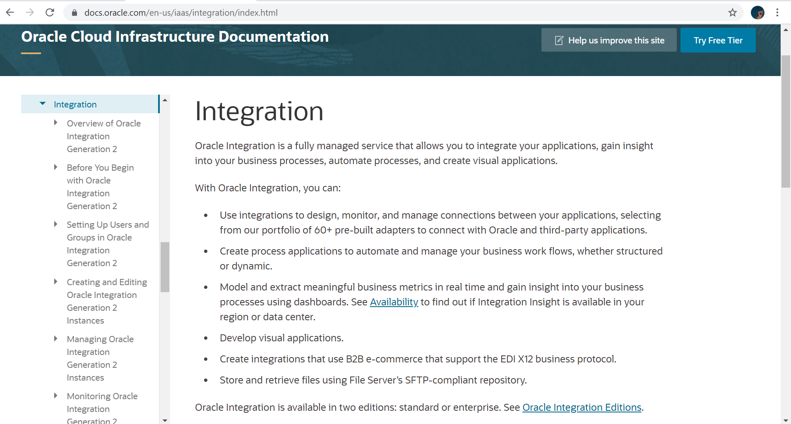
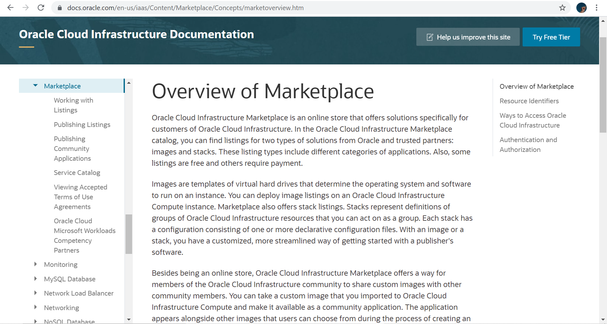
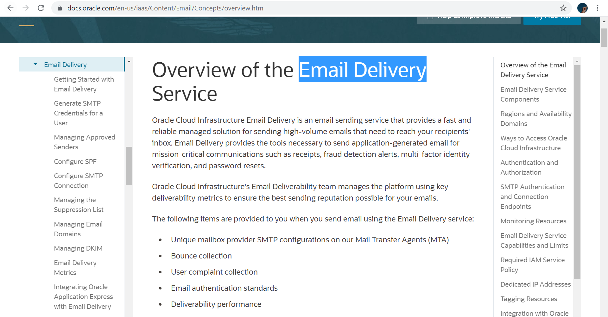
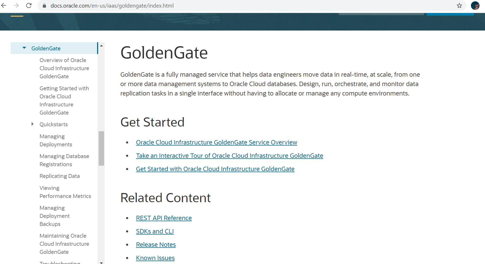

# 02 - Layanan Cloud

## Tujuan Pembelajaran

1. (bisa copy dari RPS kolom sub-CP-MK)
2. dst

## Tugas 5 Layanan Oracle

1. Audit

    

    Layanan Audit Infrastruktur Oracle Cloud :
    - untuk merekam panggilan ke semua titik akhir antarmuka pemrograman aplikasi publik (API) Oracle Cloud Infrastructure yang didukung sebagai peristiwa log.
    - Peristiwa log yang direkam oleh layanan Audit mencakup panggilan API yang dibuat oleh Oracle Cloud Infrastructure Console, Command Line Interface (CLI), Software Development Kits (SDK), klien kustom Anda sendiri, atau layanan Oracle Cloud Infrastructure lainnya

    Informasi dalam log :
    - Waktu aktivitas API terjadi
    - Sumber kegiatan
    - Sasaran kegiatan
    - Jenis tindakan
    - Jenis respons

2. Integration

    

    Oracle Integration adalah layanan terkelola sepenuhnya yang memungkinkan Anda untuk mengintegrasikan aplikasi Anda, mendapatkan wawasan tentang proses bisnis Anda, mengotomatisasi proses, dan membuat aplikasi visual.

    Dengan menggunakan layanan Integrasi Oracle :
    - dapat untuk merancang, memantau, dan mengelola koneksi antar aplikasi Anda, dengan memilih dari portofolio 60+ adaptor bawaan layanan ini untuk terhubung dengan Oracle dan aplikasi pihak ketiga.
    - aplikasi proses untuk mengotomatisasi dan mengelola alur kerja bisnis Anda, baik terstruktur maupun dinamis.

3. Marketplace

    

    Oracle Cloud Infrastructure Marketplace adalah toko online yang menawarkan solusi khusus untuk pelanggan Oracle Cloud Infrastructure. 

    Selain sebagai toko online, Oracle Cloud Infrastructure Marketplace menawarkan cara bagi anggota komunitas Oracle Cloud Infrastructure untuk berbagi gambar kustom dengan anggota komunitas lainnya

4. Email Delivery

    

    Oracle Cloud Infrastructure Email Delivery adalah layanan pengiriman email yang menyediakan solusi terkelola yang cepat dan andal untuk mengirim email bervolume tinggi yang perlu sampai ke kotak masuk penerima Anda. 

    Item berikut diberikan kepada Anda saat Anda mengirim email menggunakan layanan Pengiriman Email:

    - Konfigurasi SMTP penyedia kotak surat unik di Agen Transfer Surat (MTA) kami
    - Koleksi bouncing
    - Koleksi keluhan pengguna
    - Standar otentikasi email
    - Performa keterkiriman

5. GoldenGate

    

    GoldenGate adalah layanan terkelola sepenuhnya yang membantu insinyur data memindahkan data secara real-time, dalam skala besar, dari satu atau lebih sistem manajemen data ke database Oracle Cloud. Rancang, jalankan, atur, dan pantau tugas replikasi data dalam satu antarmuka tanpa harus mengalokasikan atau mengelola lingkungan komputasi apa pun.

