# 03 - Membuat Virtual Machine

## Tujuan Pembelajaran

1. Mengetahui layanan Oracle Cloud Infrastructure Compute
2. Mampu membuat Virtual Machine (VM) di layanan compute Oracle Cloud

## Hasil Praktikum

### Membuat VM di Oracle Cloud

Langkah 1 : Silakan login ke akun Oracle Cloud Anda masing-masing melalui tautan ini https://www.oracle.com/cloud/sign-in.html

Langkah 2: Setelah berhasil login dan ada di beranda Oracle Cloud akun Anda, silakan pilih menu di pojok kiri atas, lalu pilih menu Compute > Instances

**Jawab :**

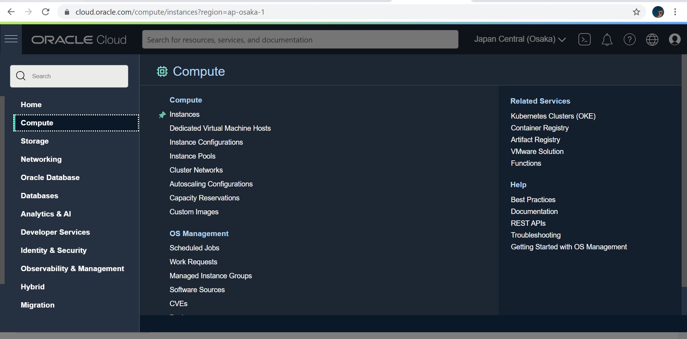

Langkah 3: Pilih Create instance untuk membuat VM baru. Pada gambar berikut akan tampil nama, status, dll terkait VM yang pernah kita buat. Jika belum ada, berarti VM belum pernah dibuat.

**Jawab :**

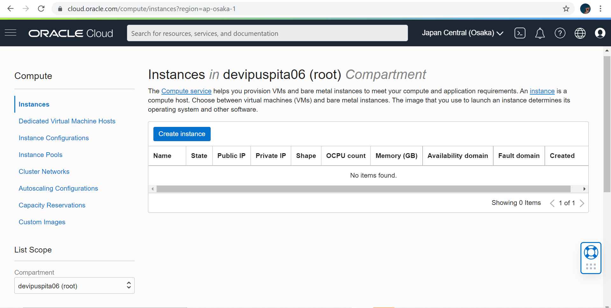

Langkah 4: Kita beri nama VM sesuai dengan keinginan. Misalnya di sini vm-ubuntu. Untuk compartment biarkan secara default dan placement pastikan Always Free-eligible (biasanya secara default sudah terpilih, jadi tidak perlu diatur lagi)

**Jawab :**

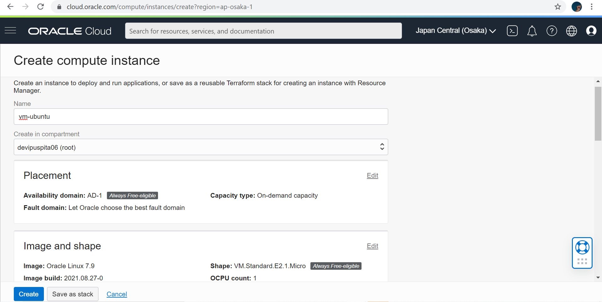

Langkah 5: Pada bagian Image and shape silakan atur sistem operasi yang akan kita gunakan, ubah menjadi Ubuntu dengan cara klik Edit. Untuk bagian shape biarkan saja, secara default biasanya menggunakan AMD VM.Standard.E2.1.Micro Always Free-eligible dengan 1 core CPU dan 1 GB RAM.

**Jawab :**

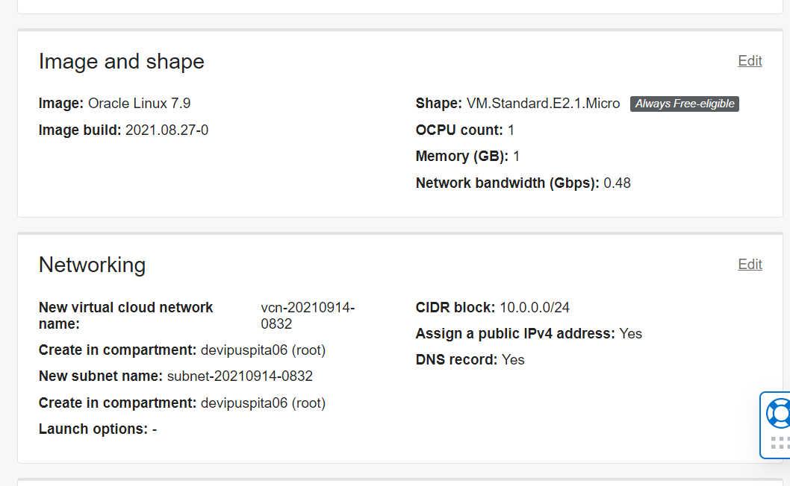

- Lakukan perubahan sistem operasi dengan klik Change image.
    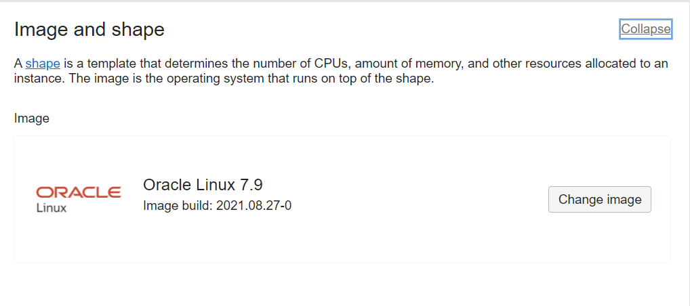

- Pilih Canonical Ubuntu versi 20.04, lalu klik Select image
    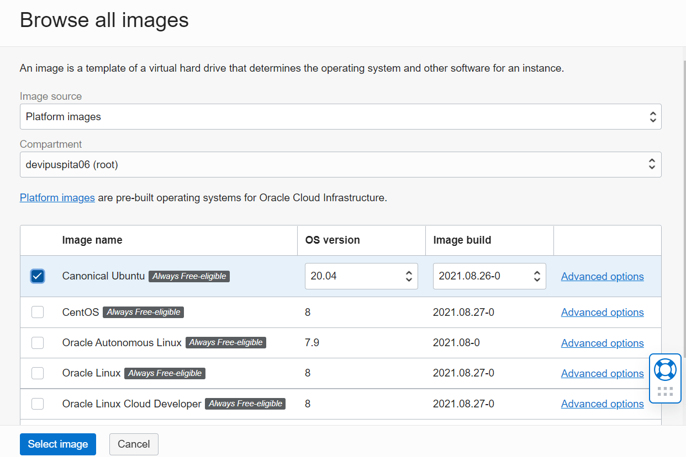

Langkah 6: Pada bagian Networking biarkan saja pengaturannya. VCN akan dibahas lebih lanjut pada pertemuan berikutnya. Secara default, akses SSH port 21 sudah bisa diakses.

**Jawab :**

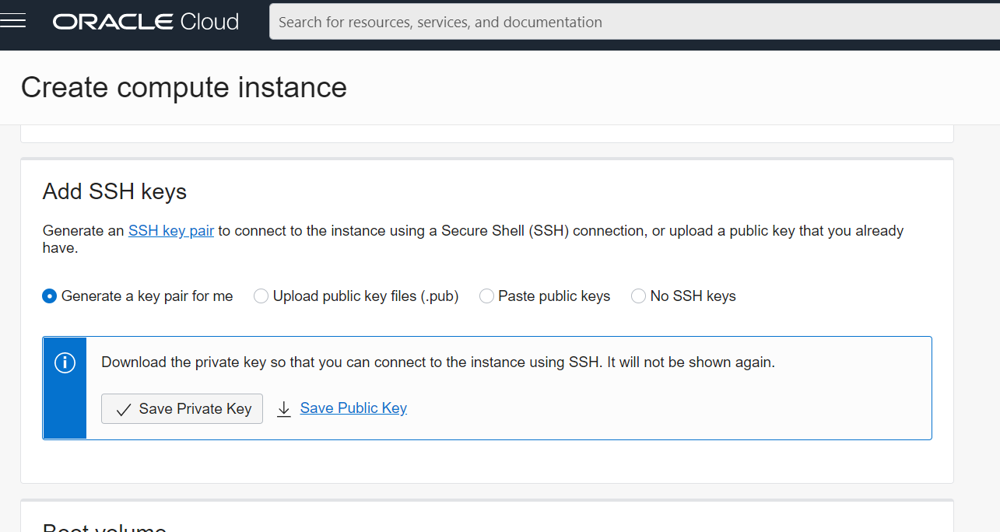

Langkah 7: Untuk kapasitas disk bisa kita atur sesuai kebutuhan, namun di sini biarkan secara default seperti pada gambar berikut, yaitu disk bervolume 46.6 GB. Langkah terakhir klik Create di pojok kiri bawah untuk memulai membuat VM.

**Jawab :**

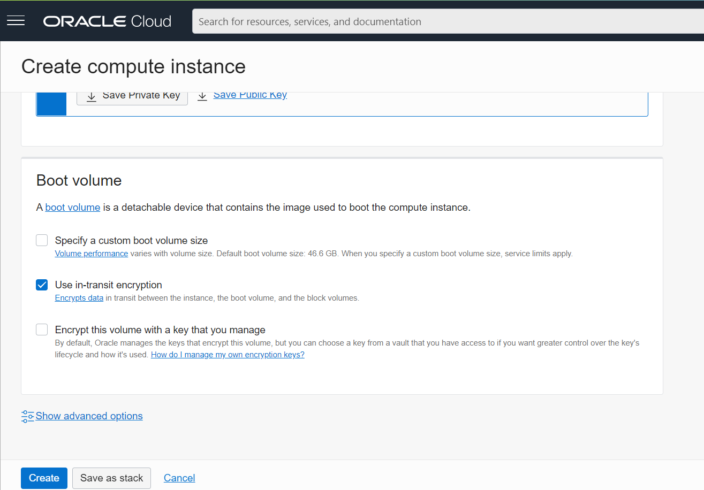

## Hasil Akhir Praktikum

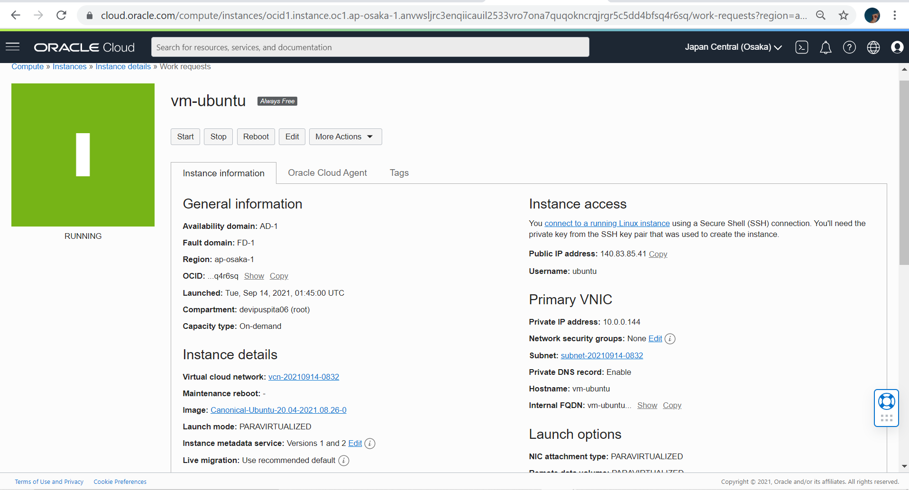

## Tugas

Carilah cara agar Anda dapat melakukan SSH ke VM yang baru dibuat berdasarkan praktikum tersebut! Lalu buatlah laporan praktikumnya!

1. Buka PuttyGen

    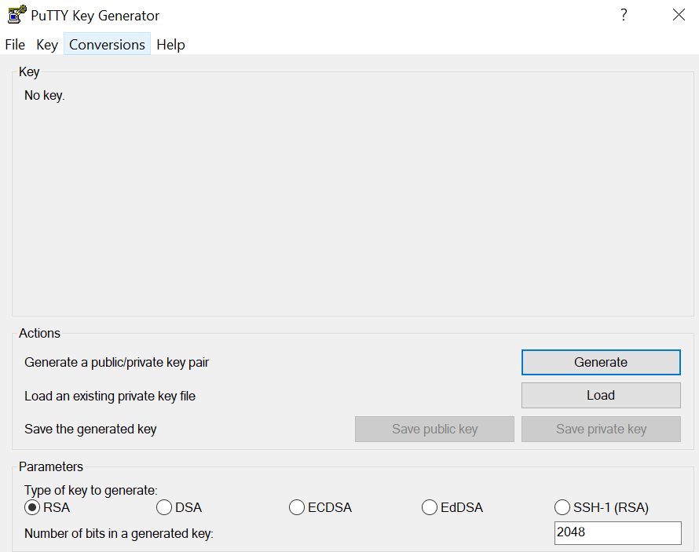

2. Pilih load untuk membuat file putty key. Setelah klik load akan memasukkan file private key yang telah di download dari hasil pembuatan instance. Kemudian save private key dan tentukan nama file tersebut.

    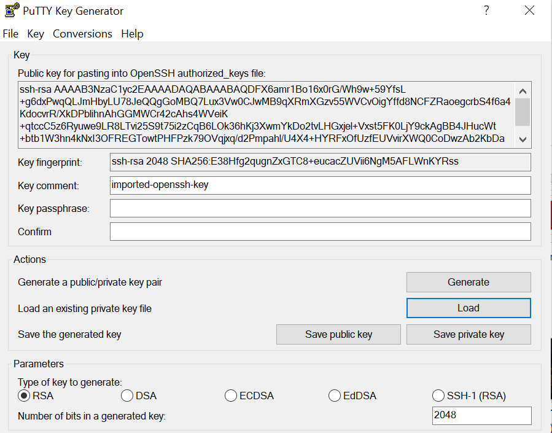

    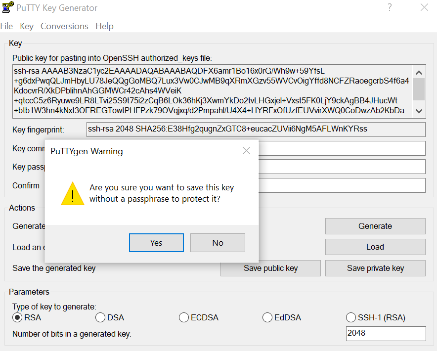

3. Kemudian buka Putty

    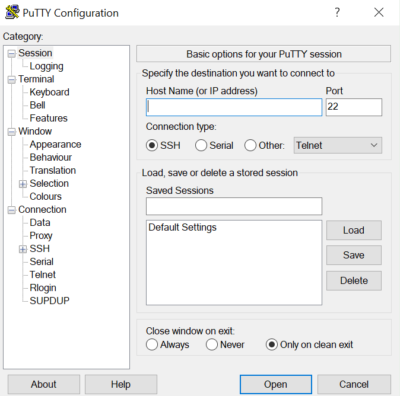

4. Pada tampilan ini isi dengan :

    Hostname : username@ip adress (isi sesuai dari instanse)

    Port  : 22

    Type : SSH

    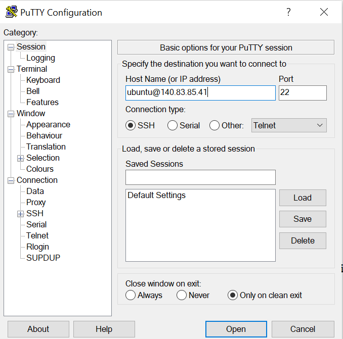

5. Selanjutnya pada jendela SSH pilih Auth, kemudian klik tombol browse untuk memasukkan file yang telah dibuat dari puttygen. Setelah selesai klik OPEN

    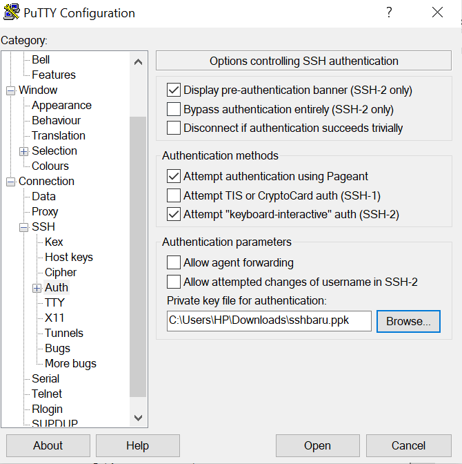

6. Maka tampilan selanjutnya seperti ini

    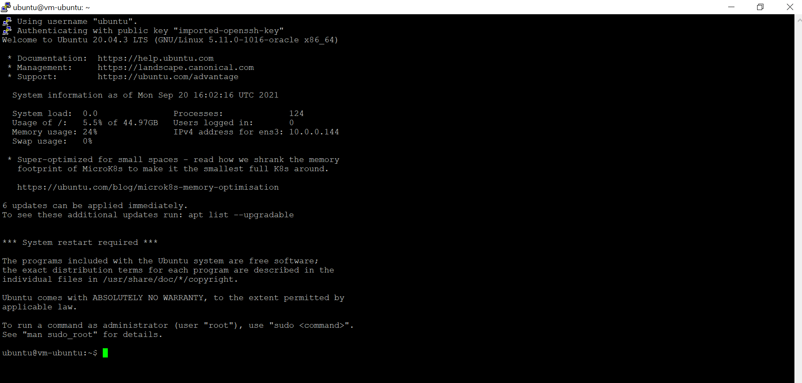

7. Cek apakah sudah terhubung dengan menuliskan uname -a

    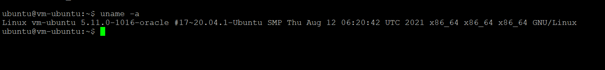

