# 04 - Virtual Cloud Network (VCN)

## Tujuan Pembelajaran

1. Mengetahui layanan Oracle Cloud Infrastructure Networking
2. Mampu mengaktifkan port 80 melalui Virtual Cloud Network (VCN) di layanan Oracle Cloud
3. Mampu memasang Apache server dan mengonfigurasi IP tables Firewalls

## Hasil Praktikum

### Praktikum 1: Mengaktifkan Port 80 melalui VCN di Oracle Cloud

Langkah 1: Silakan login ke akun Oracle Cloud Anda masing-masing melalui tautan ini https://www.oracle.com/cloud/sign-in.html

Langkah 2: Setelah berhasil login dan ada di beranda Oracle Cloud akun Anda, silakan pilih menu di pojok kiri atas, lalu pilih menu Networking > Virtual Cloud Networks

**Jawab :**

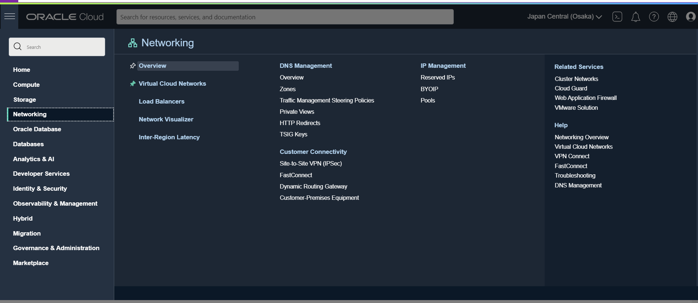

Langkah 3: Pastikan VCN sudah ada, biasanya jika berhasil telah membuat VM dari modul pertemuan sebelumnya maka VCN akan tampil di sini. Silakan klik nama VCN tersebut.

**Jawab :**

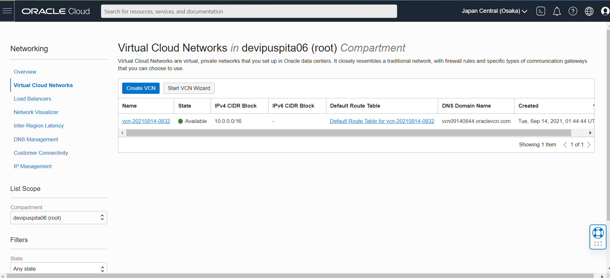

Langkah 4: Pilih Security Lists di panel kiri (Resources), lalu pilih Default Security List di tabel yang tersedia.

**Jawab :**

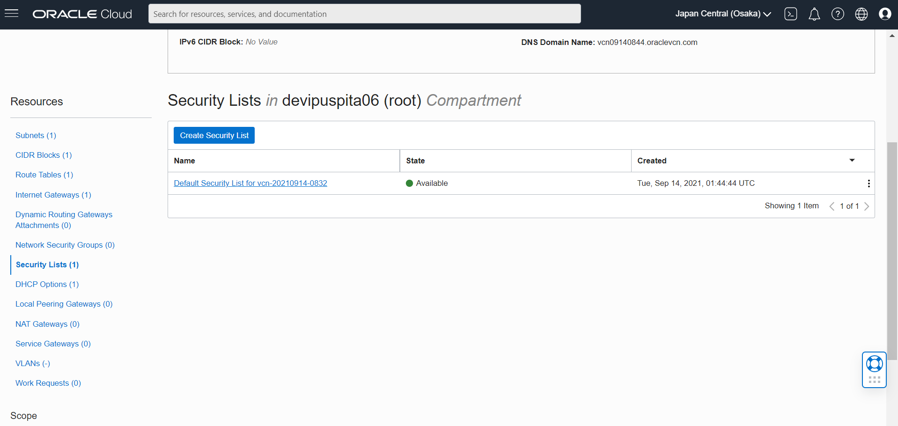

Langkah 5: Klik tombol biru Add Ingress Rules untuk menambahkan port.

**Jawab :**

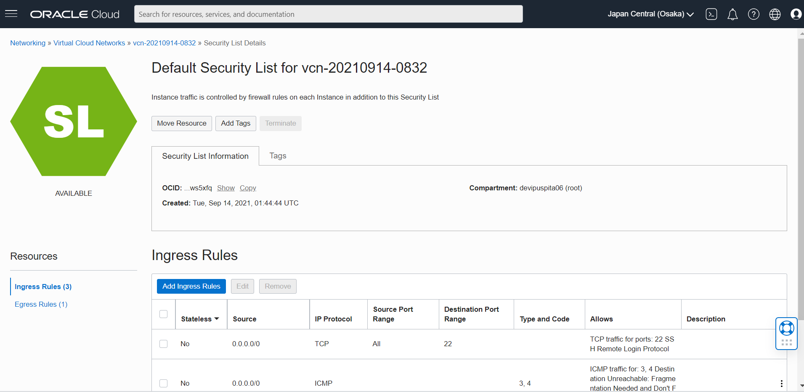

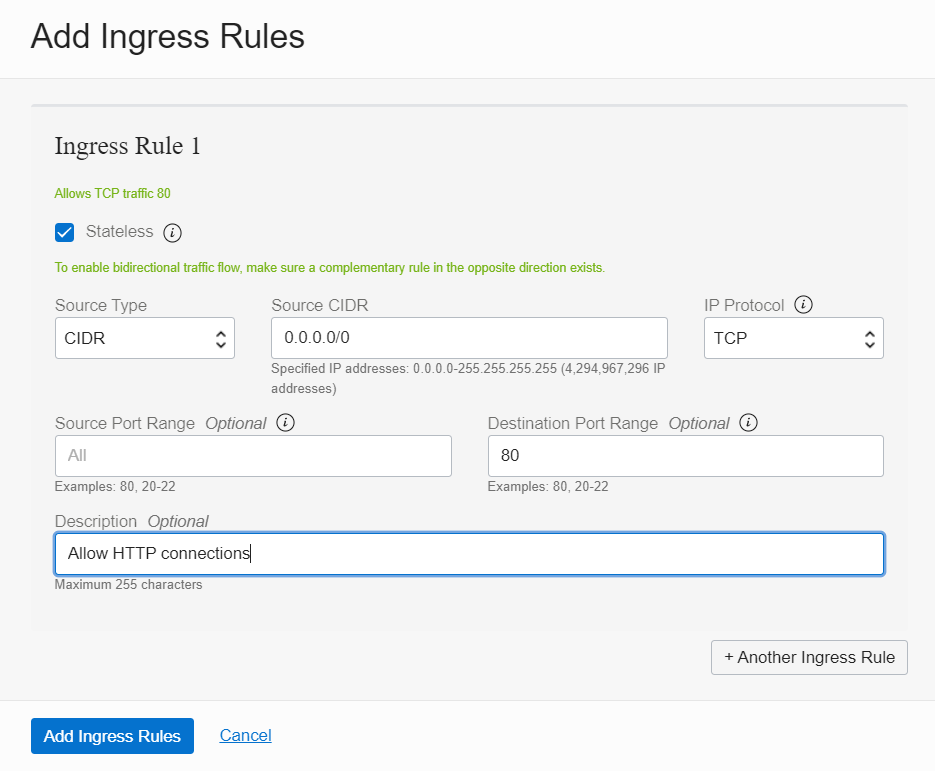

###  Praktikum 2: Setup Apache di VM

Langkah 1: Buka instance Anda melalui menu Compute > Instances, kemudian copy IP public VM yang ingin kita akses untuk diatur web server Apache.

**Jawab :**

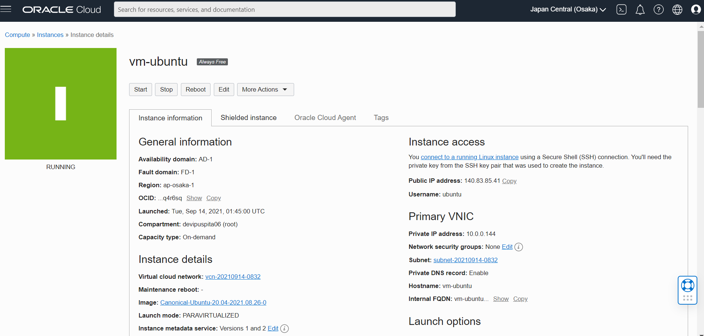

Langkah 2: Lakukan akses ke VM atau server kita dengan perintah berikut ini.

**Jawab :**

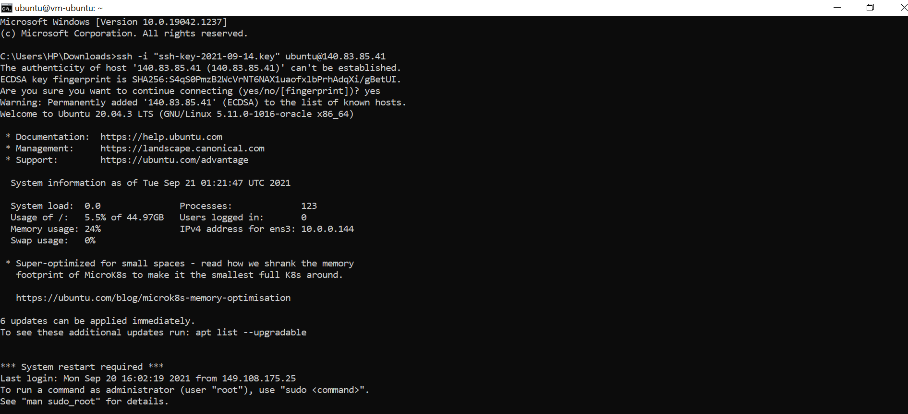

Langkah 3: Setelah terkoneksi dengan VM Anda, silakan lakukan perintah berikut baris demi baris untuk menginstall Apache server.

**Jawab :**

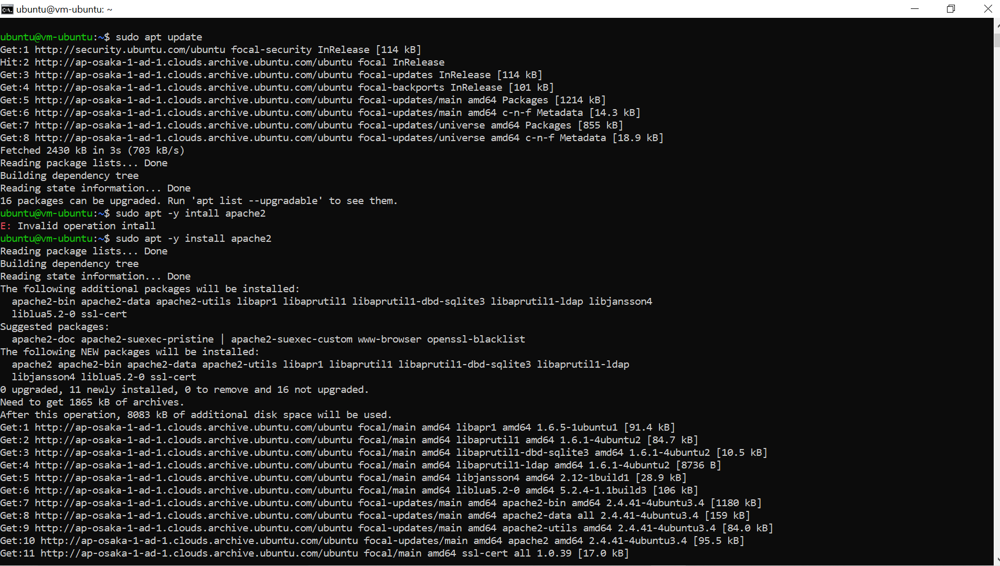

Langkah 4: Jalankan service Apache dengan perintah berikut

**Jawab :**

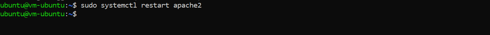

Langkah 5: Secara default pada VM Ubuntu kita untuk firewall itu statusnya disabled (tidak aktif), maka kita perlu mengaktifkannya dengan melakukan update pada iptabels terlebih dahulu. Lakukan perintah berikut baris demi baris.

**Jawab :**

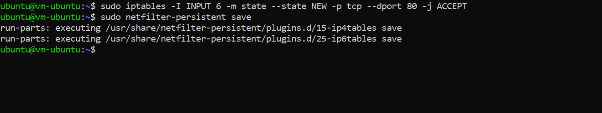

Langkah 6: Sekarang Anda dapat melakukan uji server VM Anda dengan perintah curl localhost atau buka browser di komputer/laptop pribadi Anda dan arahkan ke IP public VM yang Anda miliki. Seharusnya jika sukses, maka akan tampil seperti gambar berikut ini.

**Jawab :**

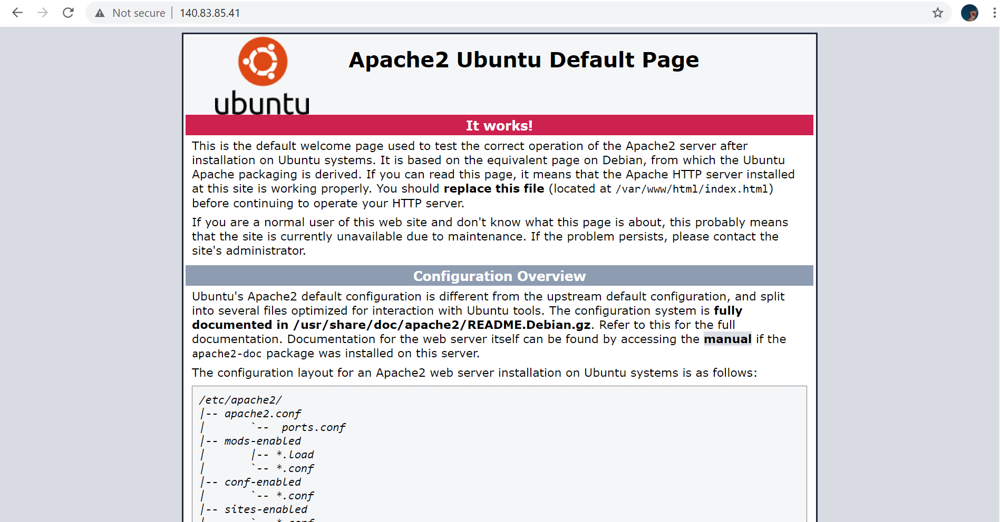
