# 05 - Platform As A Service (PAAS)

## Tujuan Praktikum

1. Mengetahui layanan yang ditawarkan cloud computing khususnya Oracle Cloud Infrastructure (OCI)

## Hasil Praktikum

1. Buka oracle terlebih dahulu

    **Jawab :**

    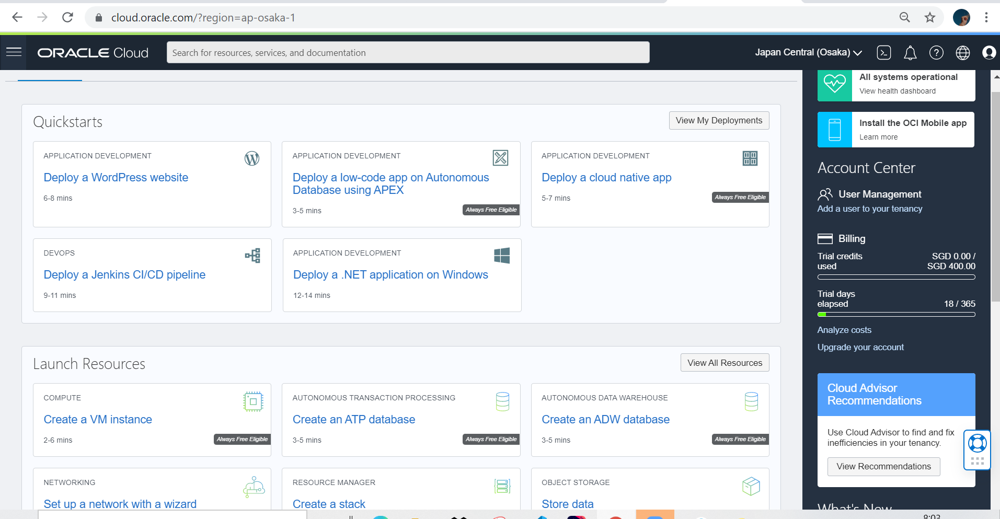

2. Kemudian terdapat sidebar sebelah kiri atas, klik "Database" -> "MySql".

    **Jawab :**

    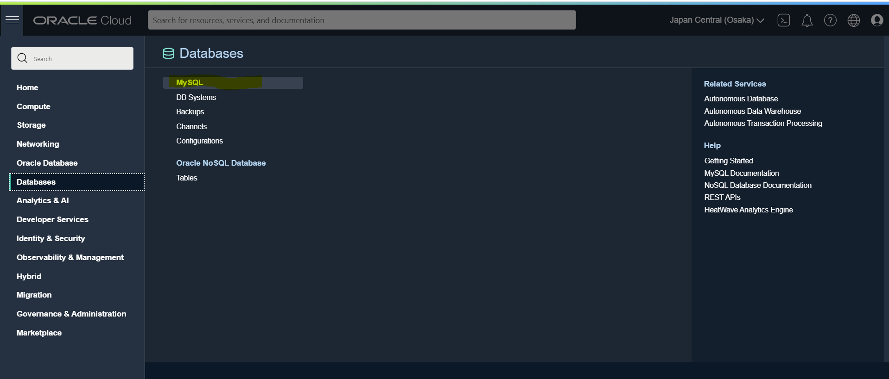

3. Tampilan selanjutnya klik "Create Mysql DB System".
    
    **Jawab :**

    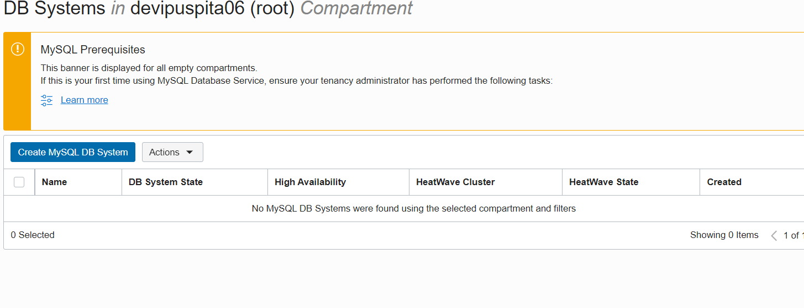

    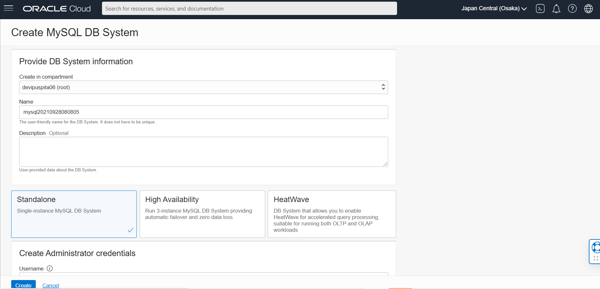

    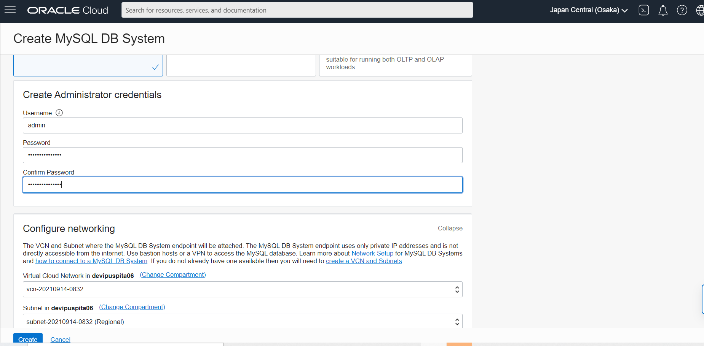

4. Setelah create akan muncul tampilan seperti dibawah ini dan  tunggu beberapa menit untuk active.

    **Jawab :**

    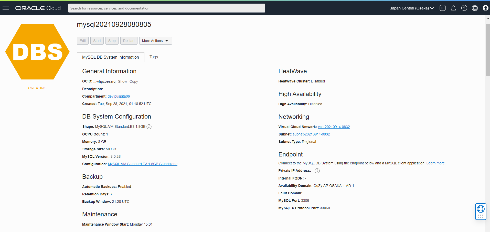

    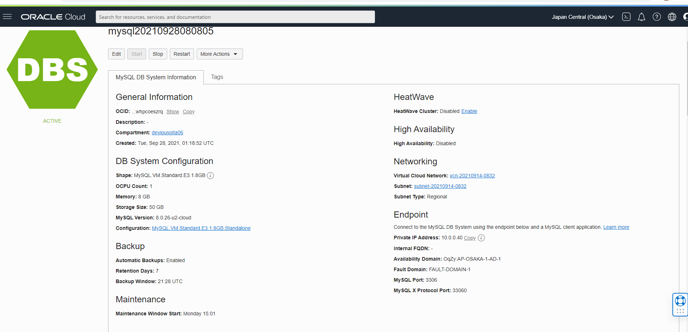

5. Setelah selesai klik "Networking" -> "Virtual Cloud Networks"

    **Jawab :**

    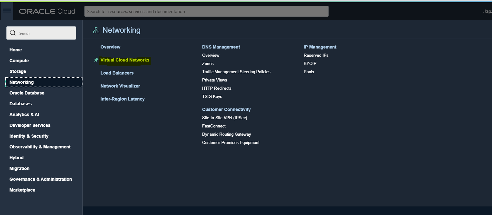

6. Kemudian klik vcn pada bagian name

    **Jawab :**

    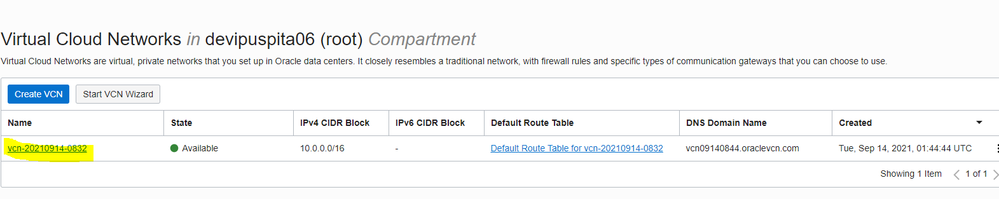

7. Setelah itu akan muncul tampilan seperti dibawah ini.

    **Jawab :**

    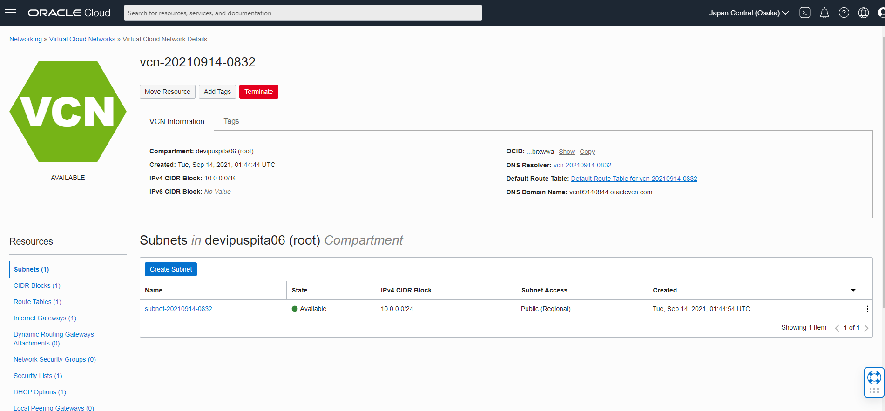

8. Selanjutnya buka "Security List" -> Lalu klik "Default Security".

    **Jawab :**

    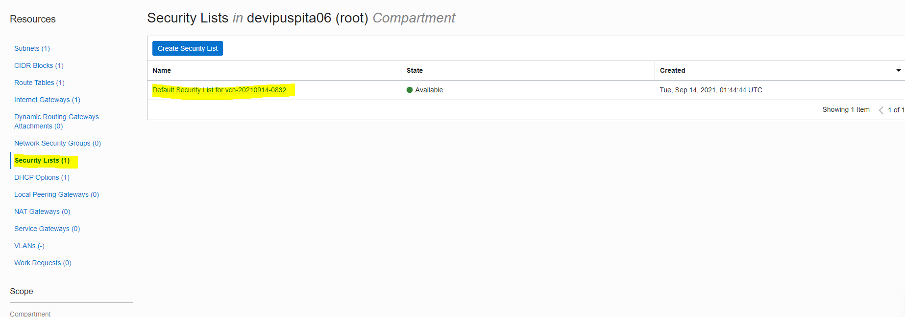

    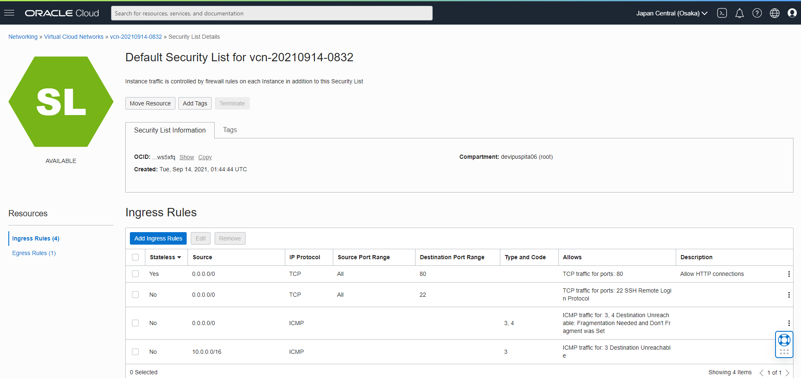

9. Klik "Add Ingress Rules".

    **Jawab :**

    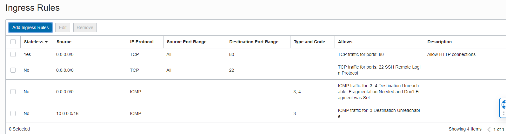

    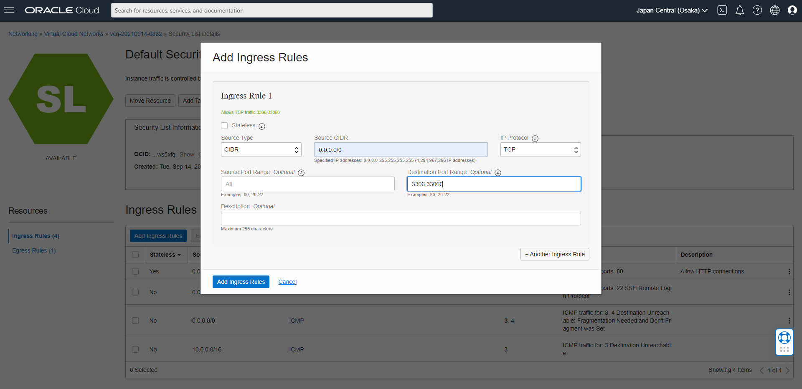

10. Lakukan akses ke VM atau server kita dengan perintah berikut ini.

    **Jawab :**

    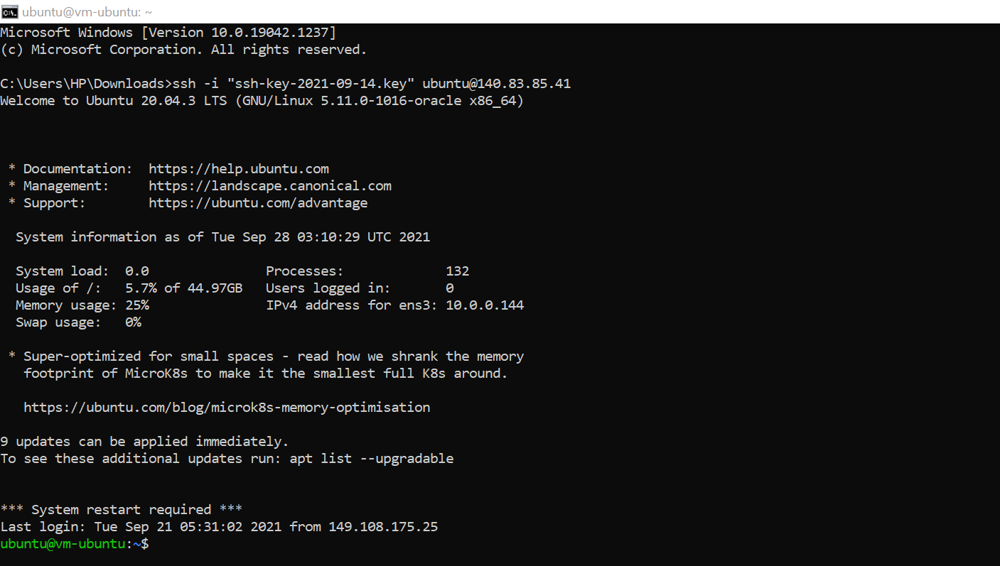

11. Setelah terkoneksi ke VM kita, lakukan instalasi my sql seperti gambar dibawah ini.

    **Jawab :**

    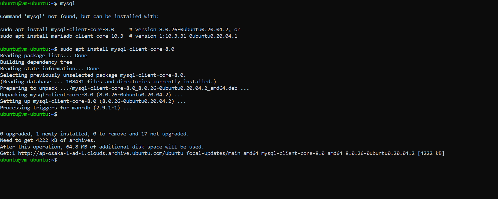

12. Jika instalasi telah selesai, selanjutnya masukkan ssh.key  dengan direktori penyimpanan.

    **Jawab :**

    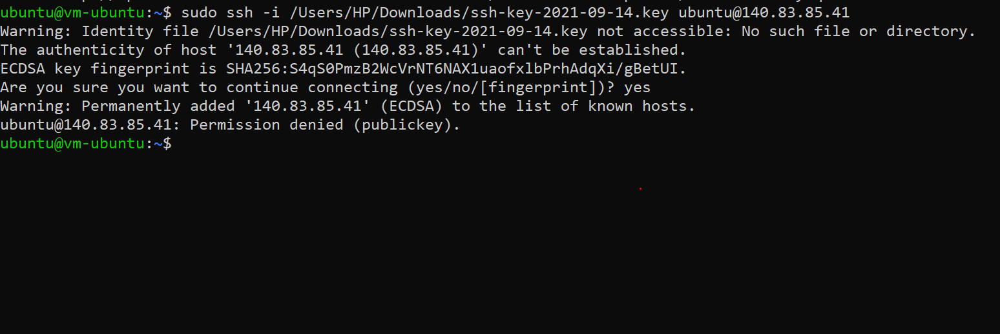

13. Kemudian buka mysql yang telah di install dengan menyantumkan IP Adress yang telah dibuat tadi pada saat create database mysql. Memasukkan password, jika benar mysql bisa dijalankan.

    **Jawab :**

    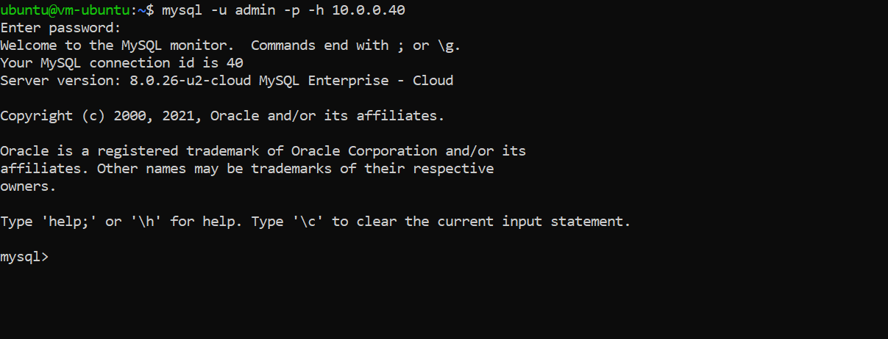

## Tugas Praktikum PaaS

1. Cari aplikasi php yang memiliki database kemudian upload ke server dan buat databasenya. 

