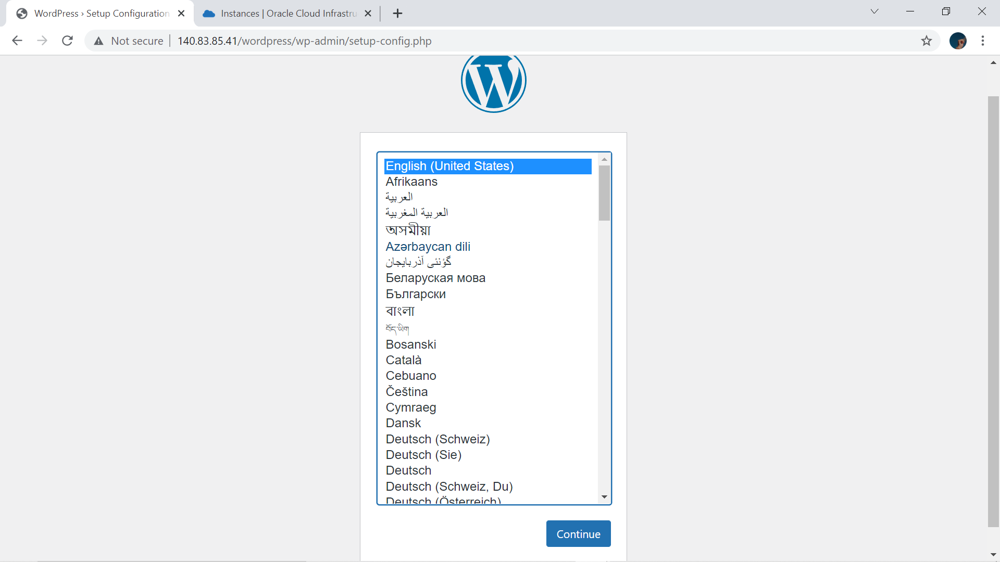

# KUIS 1

Setup aplikasi Wordpress di VM + DB yang kemarin telah dibuat.

**Jawab :**

1. Lakukan akses ke VM atau server kita dengan perintah berikut ini.

    

2. mengkoneksikan mysql dengan perintah berikut mysql -u -p -h . Setelah ini database sudah siap untuk digunakan sesuai dengan kebutuhan anda

    

Cara untuk menginstall wordpress dapat menggunakan langkah-langkah seperti berikut: 

1. Membuat Database Cara untuk membuat database pada mysql adalah dengan mengetik perintah di bawah ini.Perintah pertama untuk membuat database, perintah kedua untuk melihat apakah database kita sudah berhasil dibuat.

    - mysql> create database wordpress;

    - mysql> show databases;

    

2. Download Wordpress Pada Folder /var/www/html dengan perintah 

    - cd /var/www/html
    
    - sudo wget https://wordpress.org/latest.tar.gz;

    

3. Mengekstrak Wordpress Pada Folder /var/www/html dengan perintah ( sudo tar zxvf latest.tar.gz )

    

4. Selanjutnya setelah ekstrak file hasil download dapat dihapus dengan menggunakan perintah 

    - sudo rm -r latest.tar.gz

    - cd wordpress

    - ls

    

5. Selanjutnya menginstall extension mysql pada php dan mengaktifkannya pada php.ini. Berikut adalah perintah untuk menginstall extenstion mysql pada php.

    - sudo apt-get install php-mysql 

    

    - Install apache dan Lakukan restart apache dengan perintah seperti di bawah ini.

    

6. Sedangkan cara untuk mengaktifkan extension mysql pada php dapat diaktifkan pada php.ini. Path dari php.ini dapat dilihat pada phpinfo() seperti pada gambar berikut terletah pada sudo nano /etc/php/7.4/apache2/php.ini.

    

7. Selanjutnya Proses Intalasi Wordpress Melalui Browser dengan mengikuti langkah-langkah dibawah ini.

    - buka dengan ip adress public instance yang telah kita buat

    

8. Masukkan data-data yang digunakan untuk membuat tabel

    

9. Copy teks dibawah ini dan Buat file dengan nama wp-config.php di xampp

    

    

    - setelah membuat file copy teks di file tersebut, kemudian ctrl+X -> Y -> Enter. Kembali ke Wordpress dan jalankan pemasangan.

    

10. Isi data judul, password dan email

    

11. Jika berhasil login, tampilan akan muncul seperti di bawah ini

    

    

12. Halaman awal setelah berhasil login

    

13. Tampilan site yang telah berhasil dibuat

    

    

    

