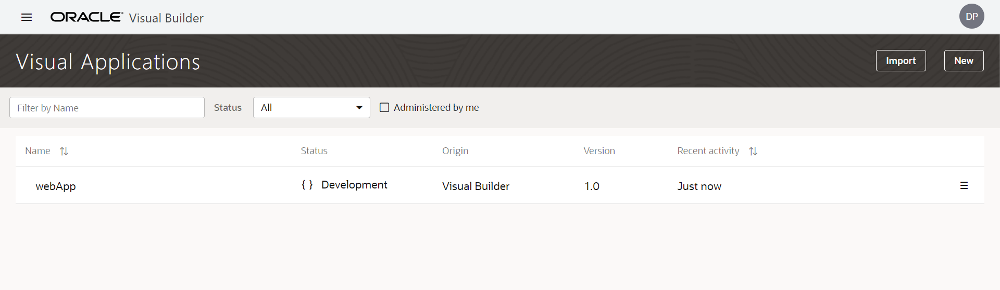

# 07 - Software As A Service (SAAS)

## Tujuan Praktikum

1. Mengetahui layanan Oracle Cloud Infrasturcture Software as a Service.

2. Mampu mengguankan layanan software layanan oracle.

## Hasil Praktikum

1. Membuat Aplikasi (Create Web Application) Login OCI -> Pilih OCI Classic Service -> Create Instace

    

    - OCI Classic Service -> Create Instace

    

    - Isi nama instace, nama, deskripsi dari instance, Region dan tak

    

    - Hasil instance yang telah dibuat:

    

    - Lihat pada pojok kiri, terdapat simbol menu (klik simbol tersebut dan akan muncul menu beriku), Kemudian pilih Open Visual Builder Home Page

    

    - Tunggu beberapa saat, kemudian jika berhasil akan muncul halaman berikut. Klik New Application

    

    - Isi informasi tentang aplikasi yang akan dibuat :

    

    - Jika kita berhasil membuat akan muncul nama aplikasi yang akan kita buat seperti gabari dibawah ini:

    

    - Klik nama aplikasi yang telah kita buat (seperti pada gambar sebelumnya), maka akan muncul halaman berikut:

    

    - Pada sisi kiri adalah menu dari (kotak berwarna merah) visual builder dari aplikasi yang akan kita buat, pilih ikon web kemudian akan muncul menu berikut : 

    

2. Pada dialog box Create Application, isi nama web dengan nama “hrwebapp” dan untuk novigation style biarkan none.

    

3. Expand hrwebapp, kita akan melihat struktur struktur dari aplikasi web, kurang lebih seperti gambar dibawah ini:

    

### Import Location Busines dari file

Pada tahap ini kita akan membuat object busines location dan melakukan import data.

1. Klik Busines Object , pada tab navigator:

    

2. Klik tombol + Busines Object.

3. Pada dialog box Busines Object, isi field label dengan “Location” kemudian tekan tombol create (pada field name akan otomatis terisi).

    

4. Klik Field tab

    

5. Klik + Field untuk menambahkan Busines Object

    

6. Ketika pup-up box, masukan
    - Label: Name
    
    - Field Name: name (automatically populated)
    
    - Type: String String (selected by default)

    

7. Pada property instpector, centang Required di bawah label constrain.

    

8. Klik Menu icon dan pilih Data Manager (Data Manager bisa kita gunakan untuk mengimpor data dari berbagai sumber)

    

9. Pilih Impor From File.

    

10. Di kotak dialog Impor Data, klik kotak impor, pilih Location.csv, dan klik Impor. Ketika impor berhasil, klik Tutup.

    

11. di panel Bisnis Object, klik Location, lalu klik tab Data untuk melihat Location.

### Department Business Object

1. Pada panel Business Objects, klik tanda +, lalu pilih Business Object

2. Pada new Business Object dialog Box, Pada field label isi dengan “Department”.
3. Klik Fields tab kemudian klik + Field.
4. Pada pop-up box, masukan:
    
    - Label: Name

    - Field Name: name (automatically populated)
    
    - Type: String String icon (selected by default)
    
    Click Create Field.
5. Pada property instpector, centang Required di bawah label constrain.
6. Klik Fields tab kemudian klik + Field

    - Label: Location
    
    - Field Name: location (automatically populated)
    
    - Type: Reference Reference icon
    
    - Referenced Business Object: Location(Reference field seperti foreign key pada database table)
    
    - Display Field: Name (automatically populated)

