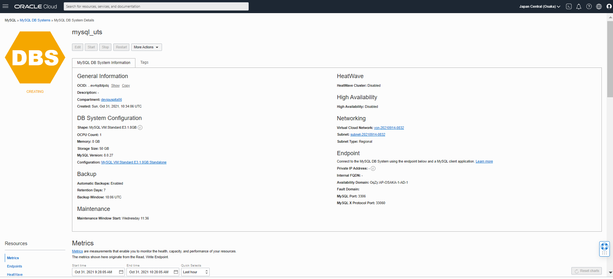

# 09 - Ujian Tengah Semester (UTS)

## Hasil Praktikum

1. Membuat Instance Compute sebagai server

    - Langkah pertama Login ke akun Oracle Cloud 

        

    - Pilih menu di bagian kiri atas, lalu pilih Compute -> Instance

        

    - Kemudian Create Instance untuk membuat VM baru.

        

    - Memberi nama VM "uts_cloud".

        

    - Pada bagian image and shape atur sistem yang akan di gunakan. Mengubah menjadi ubuntu dengan klik "Edit". Sedangkan pada bagian Shape tidak perlu di ubah (Default menggunakan AMD VM.Standard.E2.1.Micro Always Free-eligible dengan core CPU dan 1 GB RAM).

        

        

    - Selanjutnya pada bagian Networking (Default Akses SSH port 21).

        
    
    - Lalu pada bagian SSH Keys save untuk mengunduh Private Key agar VM dapat di akses.

        

    - Mengatur Disk sesuai dengan kebutuhan, setelah selesai klik Create untuk memulai membuat VM.

        

    - Menunggu tampilan state Running pada VM (2-5 menit).

        

        

2. Membuat Database Instance dan memasukkan project berbasis Web untuk di deploy pada infrastruktur yang telah dibuat.

    - Pilih menu Database -> MySQL.

        

    - Lalu Create MySQL DB System.

        

    - Isi Compartment dan jenis database.

        

    - Isi data database Administrator

        

    - Konfigurasi VCN

        

    - Konfigurasi Availability Domain

        

    - Konfigurasi Shape dari Database

        

    - Konfigurasi Backup dari Database, kemudian klik Create Database

        

    - Tunggu beberapa menit sampai database aktif

        