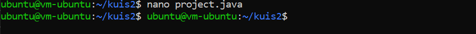
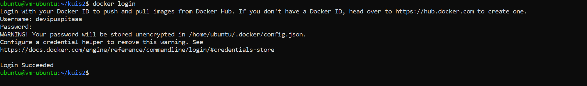

# KUIS 2

Buatlah docker image dari project UTS kemarin di push ke docker hub.
Waktu pengumpulan sampai jam 12 siang nanti, dibuktikan dengan push Laporan/SS ke repo masing-masing.

**Jawab :**

1. Build image dari project UTS

    - Membuat direktori untuk project

        

    - Masuk ke direktori project

        

    - Membuat class java

        

    - Tambahkan script di bawah ini dalam file project.java

        

    - Membuat file dengan nama Dockerfile

        

    - Tambahkan script di bawah ini di dalam file Dockerfile

        

    - Build UtsFile tersebut  menjadi sebuah images

        

    - Docker images

        

    - Menjalankan container menggunakan image yang telah di buat

        

    - Meng-upload project ke docker hub

        

    - Selanjutnya upload image yang telah di buat menggunakan perintah di bawah ini

        

    - Melakukan cek repository pada docker hub